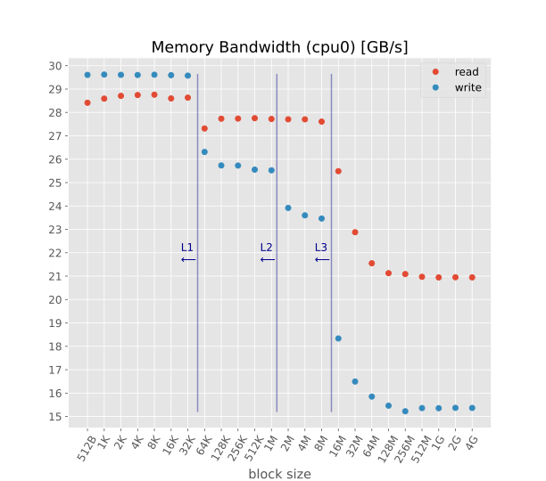
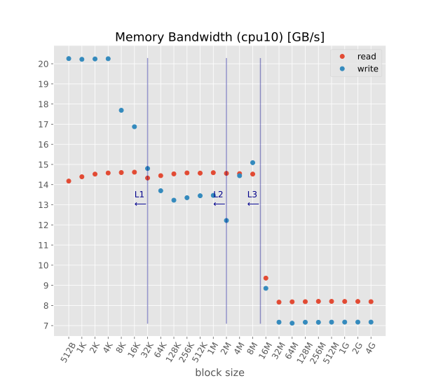
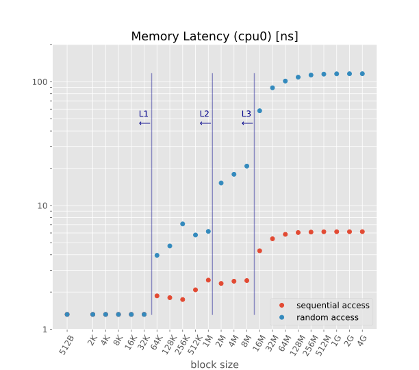
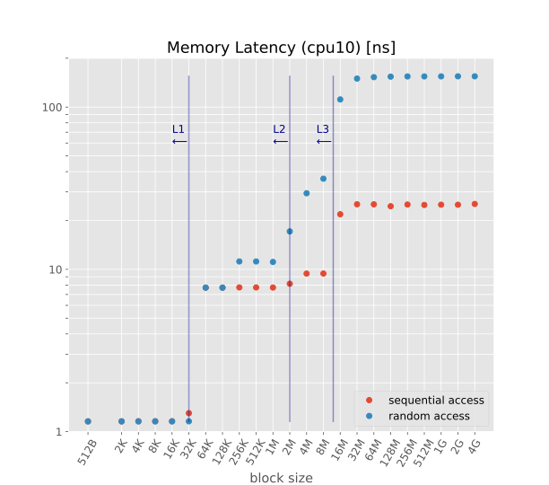

# Low Level Memory Benchmark

These are the results of a low level memory benchmark (written in C) on my [laptop](../architecture/README.md)

Benchmarks run using the software [lmbench](http://lmbench.sourceforge.net/).

## Summary plots (details below)

## Benchmarks details:

  - Bandwidth (read), [bw_mem_rd](http://lmbench.sourceforge.net/man/bw_mem_rd.8.html). Allocate the specified amount of memory, zero it, and then time the reading of that memory as a series of integer loads and adds. Each 4-byte integer is loaded and added to accumulator. 

    [Results P-core](cpu0-bwr.csv) and [Results E-core](cpu10-bwr.csv) (block size in MB, bandwith in MB/s)
  - Bandwidth (write),[bw_mem](http://lmbench.sourceforge.net/man/bw_mem.8.html). Allocate twice the specified amount of memory, zero it, and then time the copying of the first half to the second half. 

    [Results P-core](cpu0-bww.csv) and [Results E-core](cpu10-bww.csv) (block size in MB, bandwith in MB/s)
  - Latency (sequential access), [lat_mem_rd](http://lmbench.sourceforge.net/man/lat_mem_rd.8.html). Run two nested loops. The outer loop is the stride size of 128 bytes. The inner loop is the block size. For each block size, create a ring of pointers that point backward one stride. Traverse the block by `p = (char **)*p` in a for loop and time the load ladency over block. 

    [Results P-core](cpu0-lseq.csv) and [Results E-core](cpu10-lseq.csv) (block size in MB, latency in ns)
  - Latency (random access). Like above, but with a stride size of 16 bytes. 

    [Results P-core](cpu0-lrnd.csv) and [Results E-core](cpu10-lrnd.csv) (block size in MB, latency in ns)

