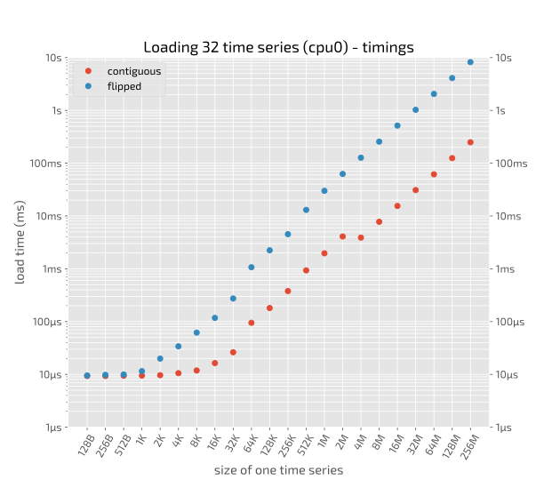
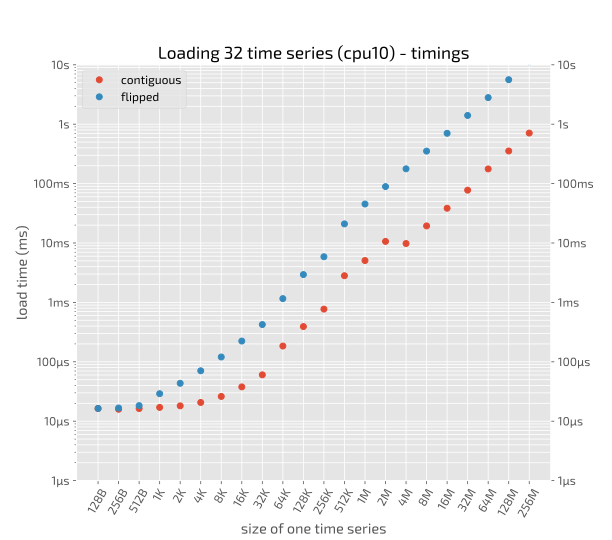
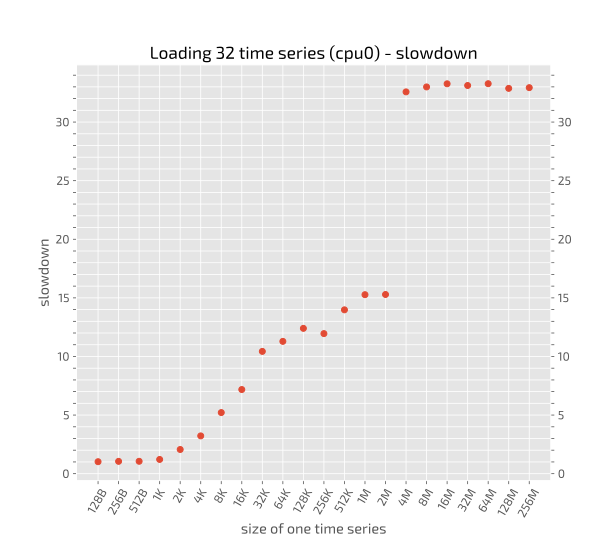
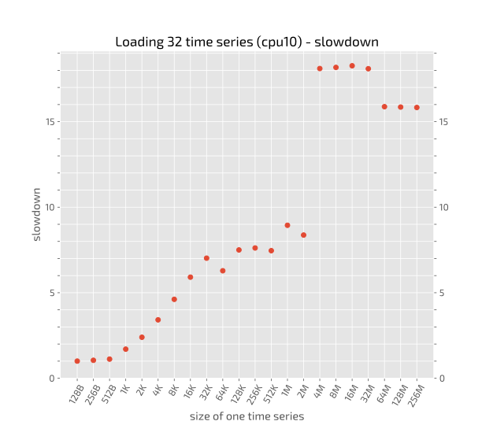

## Summary plot (details below)


## Benchmarks details:

  - Create in memory a list of `N=32` one dimensional numpy arrays of length `L` starting from `L=16` up to `L=33_554_432` in steps of powers of two.
  - Given that each item of the array is of type `float64`, i.e. 8 bytes, the size of the arrays goes from `128 B` to `256 MB`
  - Without garbage collector the total memory required is at least `32×2×256MB = 16 GB`!
  - Load the whole list in one big numpy array of size `N`x`L` (*good*) and `L`x`N` (*bad*). The corresponding loops are: 
    ```python
    # good loop (store each time series on a different row)
    for row, time_series in enumerate(collection):
        ts[row, :] = time_series
    ```

    ```python
    # bad loop (store each time series on a different column)
    for column, time_series in enumerate(collection):
        ts[:, column] = time_series
    ```
  - Time the *bad* and the *good* loop
  - Do different timings for P-cores and E-cores (details on this [here](../benchmark_low_level/README.md) 

## Plots




