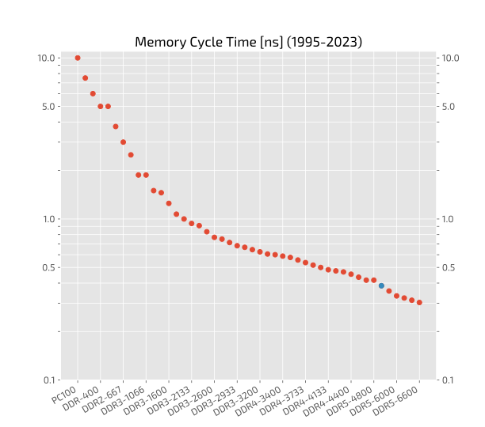
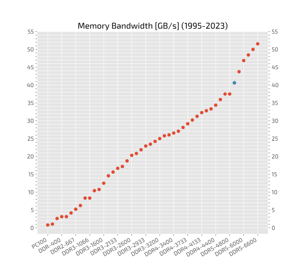
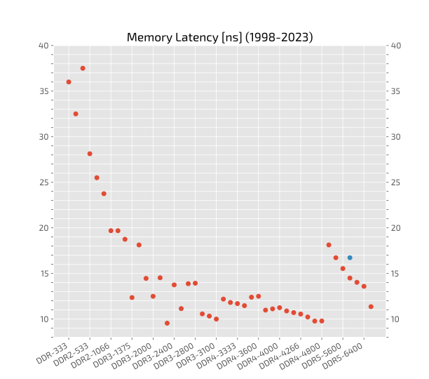
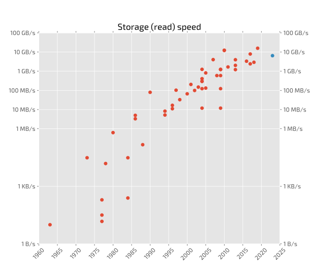

# Historical evolution of different components in a computer
## CPU Clock Rate

## Memory (RAM) Clock Cycle Time

## Memory (RAM) Bandwidth

## Memory (RAM) Latency

## Storage Read Speed

(data source: Wikipedia)
