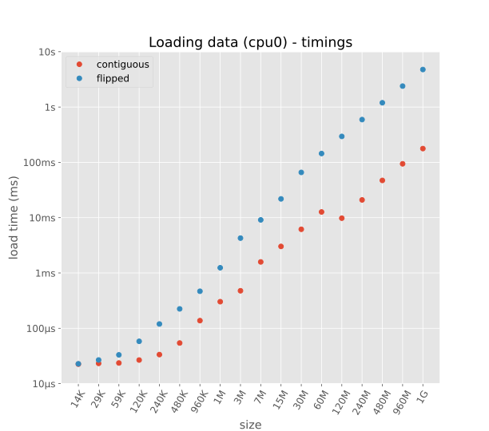
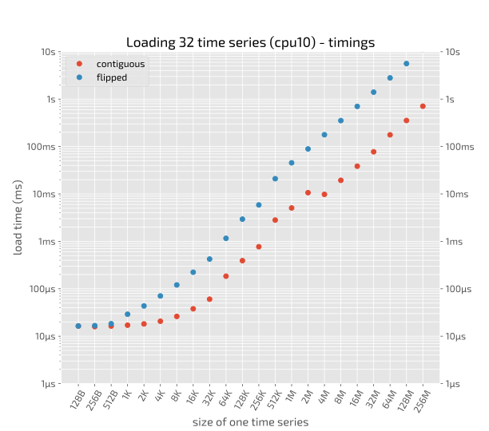
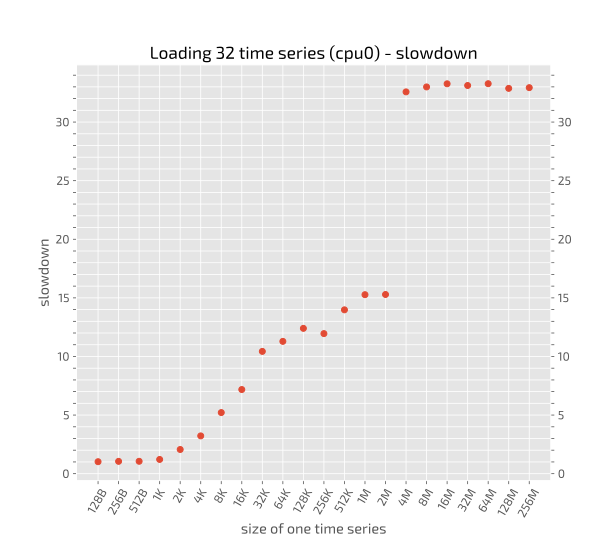
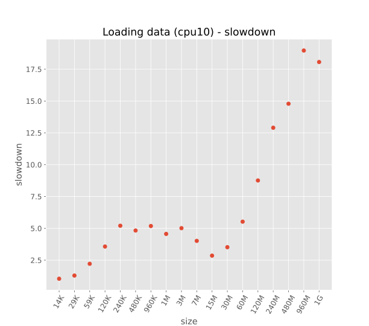

## Summary plot (details below)


## Benchmarks details:

  - Create in memory a list of `N=30` numpy arrays of size `S` from 2^6 2^23 bytes for all powers of two in between, that is from 64B up to 8MB.
  - The arrays are of type `float64`. Given that each `float64` item is 8 bytes, this mean that the arrays need to be of length L from 8 to 1,048,576.
  - Load the whole list in one big numpy array of size `N`x`L` (*good*) and `L`x`N` (*bad*). The corresponding loops are: 
    ```python
    # good loop
    for idx in range(N):
        ts[:, idx] = np.load(file)
    ```

    ```python
    # bad loop
    for idx in range(N):
        ts[idx, :] = np.load(file)
    ```
  - Time the *bad* and the *good* loop
  - do different timings for P-cores and E-cores (details on this [here](../benchmark_low_level/README.md) 

## Plots




