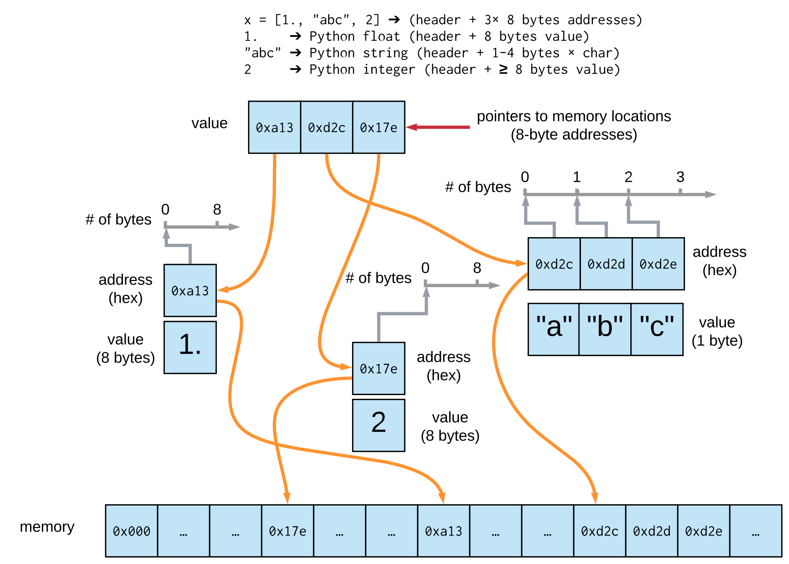

# Anatomy of a numpy array
## one dimension, float64

## two dimensions, square, float64

## two dimensions, rectangular, int32

## what about Python lists?

## interesting attributes of numpy arrays
  - `x.data`, `x.data.hex()`, `x.data.format`, `x.tobytes()`
  - `x.flags`:
    - `OWNDATA`
    - `C_CONTIGUOUS`
    - `F_CONTIGUOUS`
    - more [flags](https://numpy.org/doc/stable/reference/generated/numpy.ndarray.flags.html)

